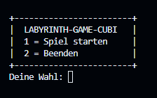
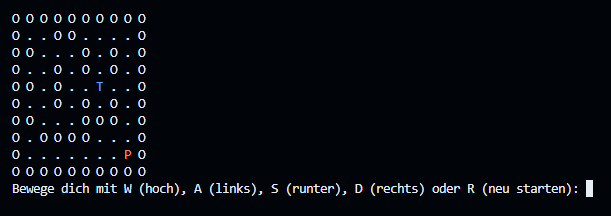
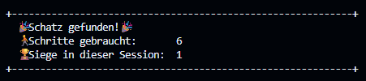

# Labyrinth-game-Cubi 🎮🕹️

Willkommen im Labyrinth!  
In diesem textbasierten Konsolenspiel steuerst du einen Abenteurer durch ein gefährliches Labyrinth voller Hindernisse auf der Suche nach einem Schatz.

Das Spiel wurde im Rahmen der **Praxisarbeit Programmiertechnik A & B (HF Elektrotechnik)** entwickelt und demonstriert den praktischen Umgang mit:

- Datenstrukturen (2D-Array)
- Benutzereingaben und Spielsteuerung
- Modularer Aufbau in C
- Dynamische Platzierung von Spieler und Schatz
- Zufallszahlen und einfache Spielmechanik

---

## 📸 Screenshots




---

## 🎮 Spielmechanik

- Du siehst ein Labyrinth in der Konsole
- Du steuerst den Spieler `P` mit **W A S D**
- Der Schatz `T` ist irgendwo versteckt
- Hindernisse `O` blockieren deinen Weg
- Wenn du den Schatz erreichst → **Gewinn!**

---

## 🗂️ Projektstruktur

```plaintext
.
├── main.c
├── game.c / game.h
├── labyrinth.c / labyrinth.h
├── player.c / player.h
├── utils.c / utils.h
├── config.h
├── README.md
└── dokumentation/
    └── Labyrinth Dokumentation Cristian.pdf
```
---

## 📑 Dokumentation

Die vollständige Projektdokumentation ist hier verfügbar:  
[Dokumentation](Dokumentation/Labyrinth%20Dokumentation.pdf)


---

## 📜 Lizenz

Dieses Projekt wurde im Rahmen der HF Elektrotechnik erstellt und darf frei zu Lernzwecken verwendet werden.

---

## ▶️ Spiel starten

Um das Spiel zu starten muss man im Terminal 3 Kommandos von hier kopieren und einfügen:

```bash
cd Spiel

gcc main.c game.c labyrinth.c player.c utils.c -o labyrinth

./labyrinth
```

---

Viel Spass beim Spielen!

